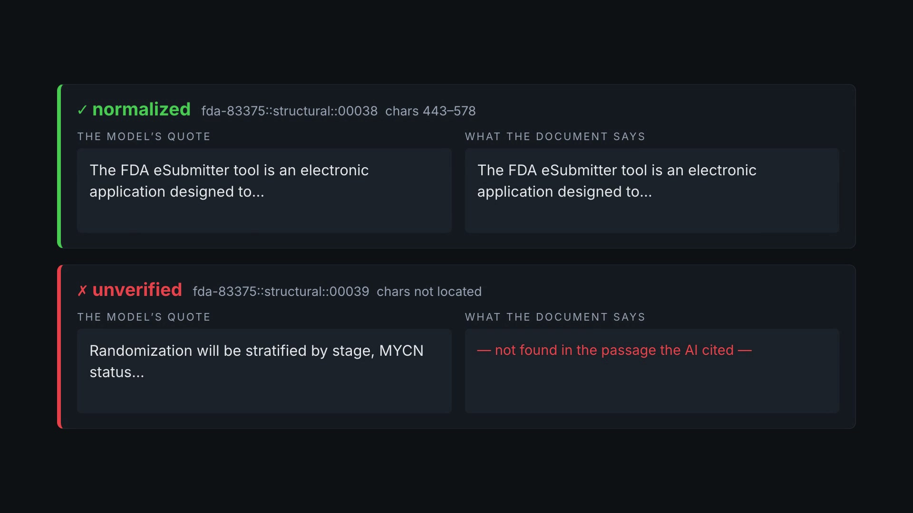
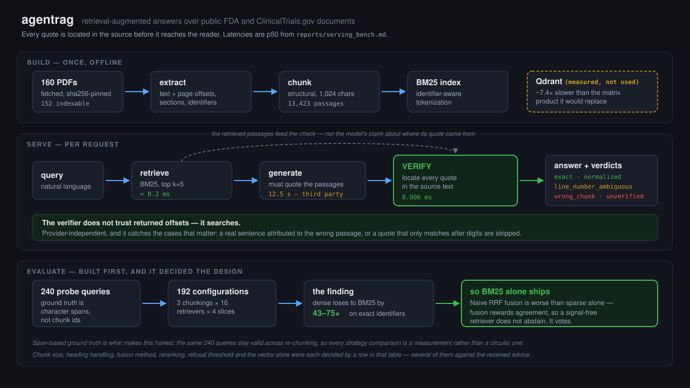

# Hybrid-search RAG with verified citations

A retrieval-augmented generation system over **152 public FDA and ClinicalTrials.gov
documents** that answers questions and then **locates every quote the model produced in
the source document before you see it** — showing the model's quote and the document's
text side by side, and saying so when a quote cannot be found.

Dense and sparse indexes, three fusion methods, cross-encoder reranking and three chunking
strategies were all built and measured. **The measurement is why the shipped service uses
BM25 alone** — see the headline result below. That is the argument of this repo: the
evaluation harness was built first, and it decided the design.

[](brag-output/brag.mp4)

<sub>▶ **38-second overview** (`brag-output/brag.mp4`). A designed recreation of real
results — every verdict in it is output from this repo's own verifier. The full technical
walkthrough is `bin/build-demo`, which renders from the live service.</sub>

> **Status: Phases 0–8 of 9 shipped**, each behind two independent verification gates — a
> code review, and a numerical audit that recomputes every published figure from raw data
> without importing the code that produced it. **1,116 tests**, lint clean.
>
> Built and serving: corpus acquisition, extraction, three chunking strategies, the
> retrieval evaluation harness, dense retrieval, three fusion methods, cross-encoder
> reranking, the chunk-size sweep, grounded generation with a refusal path, the two-tier
> citation verifier, the golden answer set, failure analysis, and a dashboard.
>
> Not done: **contextual retrieval** is built and tested but has never been run — it needs
> a metered model. **Sparse vectors in Qdrant** are unimplemented, so "hybrid lives in one
> store" is not yet true of this repo. The **demo recording** is deferred to a fresh
> free-tier quota — a calendar constraint, not an incomplete deliverable.
>
> The **two-tier citation verifier** is the centre of it: tier 1 locates every claimed
> quote in the source deterministically (22 of 22 located, zero fabricated), and tier 2
> asks a *different* model whether the located quote actually supports the answer (**7 of 8
> answers fully supported**, range 0.75–0.875 across re-runs at n=8). The judge is
> calibrated against constructed negatives before use — a real answer paired with another
> document's evidence, which cannot be supported — because a judge that answers
> "supported" to everything scores perfectly on positives alone.

## Quick start

**Prerequisites:** Python 3.11+, [uv](https://docs.astral.sh/uv/), and Docker (Colima or
Docker Desktop) for the serving path. `ffmpeg` and Chrome only if you want to build the
demo video.

```bash
# 1 — dependencies
make setup                  # uv sync with the dev / embed / vectorstore extras

# 2 — rebuild the corpus. No third-party PDFs are committed; corpus/manifest.jsonl pins
#     every document by URL + sha256, so this reconstructs the exact same bytes.
make corpus                 # manifest + fetch + characterise  (~160 PDFs, a few minutes)
make extract                # text, page offsets, sections, identifiers
make chunk                  # -> data/chunks/structural.jsonl, the index input

# 3 — credentials are OPTIONAL. Retrieval, the eval harness and the citation verifier
#     all run with none. Only generation needs a key.
cp .env.example .env.gemini # then set GEMINI_API_KEY=...

# 4 — run it
make install-agentrag       # symlink bin/agentrag into ~/.local/bin
agentrag start              # Docker VM if needed, compose, health wait  (~40s)
agentrag status             # what is up, what is healthy, what is stale
open http://localhost:8000
```

`agentrag doctor` reports anything missing. Every command echoes the underlying
`docker compose` / `uv run ragpipe` invocation before running it, so the wrapper never
becomes the only way to operate the project.

### Without Docker

```bash
make chunk && make serve    # uvicorn on :8000; Qdrant is measured, not required
```

### Reproduce the results rather than trust them

```bash
make test                   # 1,116 tests
make eval                   # the retrieval ablation -> reports/retrieval_eval.md
make bench                  # per-stage serving latency, spends no quota
make failures               # the five named failure modes
```

Every table in this README is generated into `reports/` and regenerates byte-identically.
`docs/progress.md` is the append-only log of what shipped and what was wrong.

## Architecture



Three lanes, and the middle one carries the point. **Build** runs once offline. **Serve**
retrieves in under 0.2 ms, generates in 12.5 s of somebody else's API, and verifies in 0.006 ms
— and the dashed arrow is the design decision: verification checks the model's quotes
against *the retrieved passages*, never against the model's own claim about where a quote
came from. It does not trust returned offsets; it searches.

**Evaluate** was built first and decided the rest. Ground truth is character spans rather
than chunk ids, so the same 240 queries survive re-chunking and every comparison is a
measurement instead of a circular one.

## Headline result: "hybrid always wins" is false on this corpus

The claim a RAG portfolio project is meant to demonstrate is that hybrid retrieval
beats dense-only. Measured over 240 probe queries with exact ground truth, the
interesting finding is the opposite — and it is worth more than a table where every
number goes the right way.

| Slice | Chunking | BM25 | Dense | Hybrid (RRF) |
|---|---|---|---|---|
| **exact identifier** recall@10 | `fixed` | **0.955** | **0.013** | 0.163 |
| **exact identifier** recall@10 | `structural` | **0.951** | **0.022** | 0.202 |
| section lookup recall@10 | `structural` | **0.828** | 0.739 | 0.797 |
| section lookup recall@10 | `fixed` | 0.573 | 0.416 | 0.521 |
| title lookup hit@1 | `fixed` | **0.967** | 0.900 | 0.900 |
| title lookup hit@1 | `structural` | 0.867 | 0.883 | 0.867 |
| unanswerable separability | `fixed` | **0.992** | 0.792 | 0.600 |

**The `title_lookup` row used to read `hit@10`, and every configuration scored exactly
1.000.** This project's own notes concluded the slice was saturated and should be hardened
or dropped. That conclusion was wrong, and checking it is how the row above came to exist:

| metric | spread over 48 configurations | distinct values |
|---|---|---|
| `hit@10` | 0.9833 – 1.0000 | **2** (47 of 48 exactly 1.0000) |
| `hit@1` | 0.8500 – 0.9667 | 8 |
| `mrr@10` | 0.9218 – 0.9833 | 18 |

The **slice** discriminates; the **metric** was saturated. The queries are verbatim
document titles, so finding the right document *somewhere* in the top 10 is trivial —
ranking it *first* is not, and the `hit@1` spread is 3.0 binomial standard errors at
n=60, not noise. `hit@1` over `mrr@10` because the two order all 48 configurations
near-identically (Spearman ρ 0.948, same top five) and "was the right document ranked
first" is a claim a reader can check. Dropping the slice would have discarded a working
measurement because one summary of it was badly chosen.

It also turns out to be the one slice where dense retrieval is not beaten: on
`structural`, dense 0.883 against BM25's 0.867. That margin is **one query in sixty** and
well inside the standard error, so it is not a win — it is the absence of the collapse
dense suffers on identifiers, where it loses by 43–75×.

**The vector database does not pay at this corpus size, and that is measured rather than
assumed.** Phase 3 kept the eval harness on exact cosine search specifically so this could
be isolated. Against a real Qdrant HNSW index over the same cached vectors — median over
**five independent index builds**, with the range across builds:

| | index recall@10 | top-k identical | p50 latency |
|---|---:|---:|---:|
| Qdrant HNSW, `ef=16` | 0.9167 (0.9050–0.9183) | 0.5333 (0.4833–0.5667) | 2.98 ms |
| Qdrant HNSW, default | 0.9883 (0.9833–0.9883) | 0.9000 (0.8500–0.9000) | 3.39 ms |
| Qdrant HNSW, `ef=256` | 0.9983 (0.9967–1.0000) | 0.9833 (0.9667–1.0000) | 3.48 ms |
| Exact search (numpy, in-process) | 1.0000 | 1.0000 | **0.46 ms** |

At default settings approximation costs about a point of recall — but it **reorders the
top-k for roughly one query in 10**, and rank order is what feeds fusion and
reranking. The store is also ~7.4× slower than the matrix product it replaces, of
which **~0.78 ms is transport**, measured by timing a bare HTTP round trip that
performs no search — read that split as a bound, not a partition (the report says why).
The conclusion is about scale, not about Qdrant: 13,423 × 384 is a trivial product.

Every per-build value behind those medians is persisted in `reports/ann_recall.json`
under `*_by_build`, so each aggregate is re-derivable rather than asserted.

**Why five builds.** The first version of this measurement built the index once and
reported recall and top-k agreement of exactly **1.0000**, concluding that approximation
costs nothing. Making it reproducible as `ragpipe ann` did not reproduce either figure. A
controlled run then separated the two candidate causes: two sweeps over one built index
are *bit-identical*, so search is deterministic — the variance is HNSW graph construction,
which is randomised. A single build's recall is therefore a sample, and the original
headline was that sample landing on its best value. The report now gives a median with the
observed range and re-checks the within-build determinism on every run. Full detail —
including **two further ways this measurement silently produced perfect numbers** before it
produced real ones, both of which look exactly like a successful run — is in
[`reports/ann_recall.md`](reports/ann_recall.md).

The chunking column is not decoration. An earlier version of this table omitted it
and silently mixed strategies — quoting `structural` for section lookup and `fixed`
everywhere else — which made hybrid retrieval look like a uniform win. It is not:
on `fixed`, hybrid **loses** to BM25 on section lookup (0.517 vs 0.530). Both rows
are shown so the comparison is per-population rather than cherry-picked.

**Dense retrieval loses by 43-75x on exact identifiers** (0.955 vs 0.013 on `fixed`; 0.951 vs 0.022 on `structural`). `21 CFR 314.50` and
`21 CFR 314.70` are nearly identical as strings, so they sit almost on top of each
other in embedding space while referring to entirely different regulations. This is
structural, not a tuning problem.

**Fusing the two is worse than sparse alone there — 0.163 against 0.955.** Traced on a
single query rather than inferred: for *"What are the requirements of 21 CFR 1.980?"*
the correct chunk is at BM25 rank 1 and absent from dense's top 100, while all five
fused top hits appear in *both* lists. The winner scores `1/64 + 1/62 = 0.0317`; the
correct chunk scores `1/61 = 0.0164` from one list only. RRF rewards agreement, so a
retriever with no signal contributes noise that outvotes evidence. Weighting dense at
0.7 — what the source build guide prescribes — drops it to 0.085. **Min-max at 0.1 dense
weight is the configuration that works**: 0.955 on identifiers, matching sparse-alone
exactly, so hybrid is worth having here only via score fusion at a low dense weight.

**RRF also destroys the refusal signal.** On `fixed`, separability collapses from 0.992
to 0.600 against a 0.500 majority baseline — barely better than a coin flip. RRF
discards score magnitude by design, so the top fused score barely moves whether or not
an answer exists.

Min-max fusion keeps magnitude, and *sometimes* keeps the refusal signal with it —
but this is strategy-dependent, and an earlier version of this README got it wrong by
quoting one strategy's figure in a paragraph about another:

| Min-max, dense weight | `fixed` | `structural` | `semantic` |
|---|---|---|---|
| 0.1 | 0.508 | 0.600 | 0.533 |
| 0.3 | 0.508 | 0.592 | 0.567 |
| 0.5 | 0.542 | 0.658 | 0.550 |
| 0.7 | 0.675 | 0.658 | **0.725** |

Min-max beats RRF but recovers far less than the earlier 2,048-char numbers suggested —
its best figure anywhere is 0.725 against BM25's 0.992. So the conclusion is narrower
than "min-max preserves refusal": **no fusion configuration tested comes close to
sparse-alone separability, and any threshold-based refusal in Phase 5 has to be
validated against the specific retriever that ships**, not assumed from the method.

## The chunk size we shipped was wrong, and the usual metric hid it

Phase 1b picked a 2,048-character chunk target from an estimate and never revisited it.
Sweeping 512 / 1,024 / 2,048 / 4,096 at fixed overlap says it was too big — but only if
you read the right metric.

`recall@10` on section lookup rises cleanly with chunk size (0.809 → 0.932). That reads
as "bigger is better" and it is an artifact: larger chunks mean **fewer chunks per
section**, so recall's denominator shrinks. `hit@10` — did we find the section at all —
is **flat at 0.966** from 1,024 onward, and `precision@10` falls from 0.236 to 0.109.

| target | identifier `hit@1` | identifier `hit@10` | section `hit@10` | refusal separability | **% chunks truncated** |
|---|---|---|---|---|---|
| 512 | **0.900** | 0.967 | 0.948 | **0.992** | **0.0%** |
| **1,024** | 0.850 | **0.983** | **0.966** | 0.983 | 0.6% |
| 2,048 *(old default)* | 0.833 | **0.983** | **0.966** | 0.942 | 10.4% |
| 4,096 | 0.700 | 0.967 | **0.966** | 0.908 | 31.1% |

**It is a trade, not a domination — and my first version of this section got that
wrong.** The five figures above genuinely favour 1,024, but across *all*
denominator-free metrics (`hit@1/5/10/20`, `mrr@10`) over three answerable slices and
four retrievers, **2,048 wins 22 comparisons to 1,024's 11**, with 27 ties. `mrr@10` —
which the metrics module itself calls "what a user actually sees" — prefers 2,048 on 8
of 12 slice×retriever pairs, and section `hit@1` is 0.672 at 1,024 against 0.724 at
2,048. Generalising from five favourable metrics to "every undistorted measure" was
cherry-picking, caught by the phase's numerical audit against the sweep's own JSON.

1,024 still ships, on two narrow grounds:

- **Truncation, 10.4% → 0.6%.** At 2,048 a tenth of chunks lose text before a vector
  exists. That is a correctness defect, not a ranking preference.
- **Refusal separability, +0.042**, which Phase 5's refusal path depends on.

The cost is top-of-ranking precision: smaller chunks fragment a section across more
pieces, so the single best chunk is less complete. If Phase 5 turns out to need rank-1
precision more than the refusal threshold, 2,048 is the better choice and the data to
make that call is already in `reports/chunk_size_sweep.md`.

Two mechanisms are worth naming:

- **Truncation is a function of chunk size**, not just of the model. The embedding
  window is a fixed 512-token budget, so a 4,096-character target means a third of
  chunks are clipped before a vector exists — text chosen for retrieval precision,
  discarded before it can be retrieved.
- **Refusal separability degrades monotonically with size** (0.992 → 0.908). Longer
  chunks dilute a match, so the top score separates answerable from unanswerable less
  sharply. That constrains the refusal threshold in Phase 5, arriving from an
  unexpected direction.

## Decisions measured on the way

| Decision | Effect | Slice |
|---|---|---|
| **Prepending section headings** | **+0.333 recall@10** (0.828 vs 0.495) | section lookup |
| **Identifier-aware tokenization** | **+0.402 recall@10** (0.955 vs 0.553) | exact identifier |
| **Section-aligned chunk boundaries** | **+0.255 recall@10** (0.828 vs 0.573) | section lookup |
| **Halving the chunk target** to 1,024 | **10.4% → 0.6%** of chunks truncated before embedding | all |

The first and third effects shrank when the golden set was regenerated against the
post-quarantine corpus (+0.467 → +0.333 and +0.346 → +0.255); identifier tokenization
held at +0.402. An earlier version of this section claimed each effect is *larger* at
1,024 than at 2,048. That comparison is now confounded and has been withdrawn: the
2,048 figures were measured on the previous golden set, and only a sweep re-run against
the current one could settle it. The direction of each effect is unchanged and is what
the table is for.

Standard BM25 tokenization shatters `21 CFR 314.50` into `['21','cfr','314','50']` and
drops the `.5` from `21 CFR 314.5` entirely, so distinct regulations collapse into
identical bags of the most common tokens in regulatory text. Without the fix, the slice
built to prove lexical retrieval beats dense scores 0.553, and the conclusion drawn
would have been "this corpus is unsuitable" rather than "fix the tokenizer".

The truncation row is a defect that hides as mediocre metrics: text past the embedding
model's context window is never indexed, so it cannot be retrieved, and nothing errors.

Truncation has **two independent causes**, and the sweep above and this row are about
different ones — worth separating, because they point at different fixes:

- **Across chunk sizes**, the truncation *rate* is set by the target: 0.0% at 512 chars
  rising to 31.1% at 4,096. That is the sweep's finding, and the fix is choosing a
  smaller target.
- **Within a fixed size**, which particular chunks get clipped is set by *tokenization
  density*, not by chunks running over target. At the old 2,048 default no chunk
  exceeded 2,464 characters, yet 10.4% still truncated — because regulatory text runs
  4.54 chars/token at the median but **1.16 at the floor**, and the floor is
  table-of-contents dot leaders, where `....................` costs about one token per
  character. One chunk spent 1,819 tokens on 2,108 characters of navigation and evicted
  everything after it. The fix there is normalization, which is what the row measures.

Both are needed: collapsing dot leaders reclaimed 11.2% of tokens at a fixed size, and
halving the target cut the truncation rate from 10.4% to 0.6%.

## Why the evaluation comes first

The headline claim of a RAG project is "hybrid retrieval beats dense-only." That
claim is worth nothing without a number attached, so this project builds the
measurement apparatus before the thing being measured:

| Phase | Deliverable | Status |
|---|---|---|
| 0 | Corpus acquisition + characterisation → `reports/corpus_report.md` | shipped |
| 1a | Extraction: text, page offsets, section structure, identifiers | shipped |
| 1b | Chunking strategies + near-duplicate clustering | shipped |
| 2 | **Retrieval eval harness** — hit@k, recall@k, nDCG, separability. No LLM, no cost | shipped |
| 3 | Dense + fusion variants + reranker + semantic chunking → **the ablation table** | shipped |
| 4 | Contextual retrieval + chunk-size sweep → table with cost and latency | shipped (contextual retrieval built, not run) |
| 5 | Grounded generation, span-level citations, two-tier verifier, refusal path | next |
| 6 | Generation eval — correctness, faithfulness, citation precision/recall | |
| 7 | FastAPI service + query dashboard + Docker | |
| 8 | Failure analysis and write-up | |
| 9 | Publish: GitHub, personal site, resume | |

Splitting evaluation in two is deliberate. Retrieval metrics need only
`question → relevant chunk IDs`, so they are free and fast enough to run on every
change; generation metrics need golden answers and a judge model, so they run
before commits. Building the retrieval ruler in Phase 2 means every choice in
Phases 3–4 is measured rather than assumed.

## The corpus

Public FDA guidance documents plus ClinicalTrials.gov trial protocols. Chosen
over the usual open-source-docs corpus because its metadata maps directly onto
capabilities worth demonstrating:

| Corpus property | What it makes testable |
|---|---|
| Draft and Final revisions of the same guidance | "Which version is authoritative?" |
| Issue dates spanning five decades | Temporal reasoning, superseded documents |
| Issuing center (CDER, CDRH, CBER, …) | Document-level ACL / permission-filtered retrieval |
| CFR citations (`21 CFR 314.50`) — 521 distinct, 69% of documents | Exact-identifier queries, where lexical retrieval beats dense outright |
| Protocols from industry, academic, and NIH sponsors | Structural heterogeneity for the chunking comparison |
| Schedule-of-assessment tables | Table-lookup retrieval, the hardest extraction case |

Phase 0 planned the exact-identifier slice on FDA **docket** IDs, because 93
documents list one in their metadata. Body text disagreed: only 29 distinct dockets
appear in it, against 521 distinct CFR citations. The slice was rebuilt on CFR — a
decision made from a measurement, not from the plan.

No employer or proprietary documents are used. Both sources are public;
FDA-authored content is US Government work.

## Reproducing the corpus

```bash
make setup     # uv sync
make corpus    # manifest -> fetch -> stats
```

PDFs are **not** committed. `corpus/manifest.jsonl` records every document's URL
and — once it has been fetched — its sha256. The first fetch establishes each
pin; every later fetch *verifies* against it and fails loudly on a mismatch, so an
upstream document that changes is a visible error rather than silent corpus drift
(`--allow-drift` re-pins deliberately). That is what makes `make corpus`
reconstruct the same corpus without this repo redistributing third-party files,
and those same hashes are the change-detection key for incremental re-indexing in
Phase 1 — one artifact, two jobs.

The seed pins *our* selection, not the upstream indexes. Both sources are live, so
a rerun months later may see a different candidate pool; the committed manifest
plus its hashes is what actually reproduces a corpus.

Set a real contact address before running at volume:

```bash
export RAGPIPE_USER_AGENT="ragpipe/0.1 (you@example.com)"
```

Individual stages, if you want them separately:

```bash
uv run ragpipe manifest --fda-n 120 --ctgov-n 40 --dry-run   # preview the sample
uv run ragpipe fetch                                          # resumable, hash-verified
uv run ragpipe stats                                          # rebuild the report
uv run ragpipe extract                                        # PDF -> text, sections, identifiers
uv run ragpipe chunk                                          # all three strategies + dedup
uv run ragpipe evalset                                        # golden set, span-based truth
```

The full ablation table, including every row quoted above:

```bash
uv run ragpipe eval --with-ablations \
  --dense-models bge-small \
  --fusion-weights 0.1 0.3 0.5 0.7 \
  --rerank-model bge-reranker-base --candidate-k 50
```

Embeddings are cached on disk, keyed by the exact text embedded, so re-running the
eval after the first pass costs nothing. That is what makes retrieval metrics cheap
enough to gate every change — the premise the whole phase ordering rests on. Models
download from Hugging Face on first use (~130 MB for `bge-small`, ~1.1 GB for the
reranker) and run locally on MPS/CUDA/CPU.

## Where it fails

Five failure modes, each with a figure from a committed artifact, regenerated by
`make failures` into [`reports/failure_modes.md`](reports/failure_modes.md). Writing this
section is what caught a corpus statistic that three live source files had been quoting
since before the post-quarantine regeneration — so the report derives every number from a
payload, and a mutation test fails if any of them survives replacing the inputs.

1. **Dense retrieval collapses on the query type this corpus is for.** BM25
   0.9553 against dense 0.0128 on exact identifiers — a factor of
   **75**. And naive RRF fusion is *worse than sparse alone*
   (0.1628), because fusion rewards agreement, so a retriever with no signal
   does not abstain — it votes.
2. **Reference answers manufacture obligations.** 8 of the golden set's
   answers restated a recommendation as a requirement (`should` → `must`), including a
   pregnancy-discontinuation instruction. All 8 passed five machine
   checks, because the last one is word coverage and a bag of words cannot tell `may` from
   `shall`.
3. **The over-refusal rate was mostly a labelling failure.** 4 of
   12 answerable queries refused looks like a broken gate; the
   `exact_identifier` ground truth marks a chunk relevant when the identifier merely
   *occurs* in it, so refusing "what are the requirements of 21 CFR 1.980?" about a
   document that only cites it is **correct**. Excluding that slice:
   1 of 8.
4. **Answers reach past the span they cite.** Tier 1 located every claimed quote; tier 2
   found one answer in eight synthesising across a chunk while citing one span. A quote
   being real is not the same as a quote being sufficient.
5. **The verifier's own tier certified a change in meaning.** A citation tier that
   discounted line-adjacent integers scored a model's "40 CFR" as verifying a document's
   "21 CFR". Exposure: **7,141 of 13,423 chunks
   (53.2%)** lose a digit to that normalisation. Demoted to a
   non-verified diagnostic.

Two more have been seen in live use and appear in **no** artifact — a `wrong_chunk`
citation on the very first request served, and a production `line_number_ambiguous`. They
are labelled anecdotes rather than rates, because the free tier's 20-requests-per-day
ceiling is what holds the generation sample at 16.

## Serving it

```bash
make chunk          # data/chunks/structural.jsonl — the index input (gitignored)
agentrag start      # colima if needed, then the API on :8000 and Qdrant on :6333
agentrag status     # what is up, what is healthy, what is stale
```

`bin/agentrag` is a single entry point for the stack, on PATH via a symlink into
`~/.local/bin`. Bringing this up by hand is four steps in order — Docker VM, compose,
health wait, then knowing which port is which — and each wrong order fails in a way that
looks like the app being broken rather than the sequence being wrong: compose against a
stopped VM reports a daemon socket error, and an unhealthy Qdrant is indistinguishable
from a Qdrant whose healthcheck shell lacks `/dev/tcp`.

```bash
agentrag                        # every command, grouped
agentrag query "..." -k 5       # ask; --retrieve-only skips generation and costs nothing
agentrag stop [--all]           # containers; --all also stops the VM
agentrag ann [--builds N]       # the ANN measurement (overwrites reports/ann_recall.*)
agentrag doctor                 # prerequisites, ports, and what is missing
```

It echoes every underlying command before running it, so it never becomes the only way to
operate the project, and `make up` / `docker compose` / `uv run ragpipe` all still work
directly. `agentrag start` sources `GEMINI_API_KEY` from `.env.gemini` and passes it to
compose as an environment variable, so no key enters an image layer and none is printed.

`http://localhost:8000` is a single-page dashboard whose centre is the thing this project
exists to demonstrate: **each citation's quote word-diffed against what the document
actually says**, with the verification verdict and the character span that produced it.

The diff is the point. Two panes of text side by side technically contain the answer, but
the differences that matter are one token wide — and they are exactly the ones Phase 6
found lexical coverage scoring 1.000 and accepting:

```
model : as required under [-40-] CFR 314.50 the sponsor shall report
source: as required under [+21+] CFR 314.50 the sponsor shall report

model : the sponsor [-shall-] submit a report
source: the sponsor [+may+] submit a report
```

Both panes are shown even when they match, because showing the source only on a mismatch
would make "verified" the one state where you cannot check the work. When the two are equal
after whitespace collapsing — the common PDF case, a doubled space left by stripping a line
number — the panes render plain and say so, rather than putting highlights under a legend
claiming there is nothing to highlight.

Around it: example **questions** including one the corpus cannot answer, so you can watch a
refusal rather than take it on trust; the ranking with match bars, a `quoted` badge showing
which passages the answer actually used, and expandable passage text so a hit can be judged
instead of assumed; per-stage timings for the request; and a plain-language latency strip
from `/stats`. Verdicts carry a glyph as well as a colour so they survive a greyscale
screenshot, the status line is announced to assistive tech, and `?q=…&k=…` makes any query
a shareable link that re-runs itself.

**It is written for someone who has never seen the project.** The controls say "passages to
read" and "search only", not `k` and `retrieve_only`; jargon that survives — BM25, passage,
verified — is defined in a glossary on the page; the first paint explains search → answer →
verify instead of showing an empty box; and the API routes and the per-token-rate discussion
are folded into a "For developers" disclosure rather than dropped on a first-time visitor.
An earlier version failed every one of those, and a screenshot review is what found it.

The three refusal sources are reported as what actually happened: only `model` means a
model was asked and declined — `no_context` and `score_gate` refuse before generating and
spend no quota.

Without a key the service comes up retrieval-only and `/health` says so, because the
retrieval half is fully local and a demo that cannot start without a third-party
credential is a worse demo. With one, set `GEMINI_API_KEY` in the environment (compose
passes it through; it never enters an image layer).

| route | |
|---|---|
| `GET /` | the dashboard |
| `GET /health` | readiness, chunk count, and *why* generation is unavailable if it is |
| `POST /query` | retrieve → answer → verify; `retrieve_only` skips generation entirely |
| `GET /stats` | per-stage p50/p95 and token totals over requests actually served |
| `GET /docs` | OpenAPI |

**Per-stage timing.** `make bench` regenerates this into
[`reports/serving_bench.md`](reports/serving_bench.md):

| stage | n | p50 | p95 | source |
|---|---:|---:|---:|---|
| retrieve — BM25 over 13,423 passages | 540 | **< 0.2 ms** | < 0.4 ms | measured |
| verify — locate every quote in the source | 24 | **0.006 ms** | < 0.4 ms | measured |
| generate — Gemini, network | 16 | **12.5 s** | 27.1 s | stored |

The two local rows are deliberately **bounded rather than quoted to three decimals**. They
are wall-clock timings over samples the payload does not retain, so they move a few percent
on every `make bench` — and an earlier version of this table published `0.173 ms`, which one
re-run during a verification pass silently made wrong. A figure you cannot reproduce should
not be printed to a precision that implies you can. `generate` is exact because it is read
from 16 stored per-call latencies.

An earlier version of this table quoted three **single observations** and labelled them
`n=1`. Honest, but they lived in no report, which made them a measurement the project
could not re-run — the defect that had already cost the ANN report its headline. Each
stage now carries its own `n`, because they cannot be sampled the same way: retrieval is
local and free, verification is local and free but needs citations so it **replays the
real ones already stored**, and generation is a third-party call against a
20-requests-per-day free tier, so it is read from that stored run rather than re-measured.

Two findings fell out of sampling properly rather than once:

- **Generation latency is a distribution, not a number** — 2.2 s to 27.1 s, a
  12.6× spread on one model, only weakly tracking output size. So it is
  provider variance, and any single figure from this project — including the ~6.3 s an
  earlier live request showed — is one draw.
- **Verification cost depends on the verdict it reaches.** An answer whose quotes all
  matched exactly verifies in under 0.01 ms; one containing a `normalized`
  match takes roughly 0.13 ms — **27×** more, because normalising rebuilds the chunk with an index map back to the
  original offsets. `normalized` is the *common* case in PDF text, so real traffic sits at
  the expensive end — still five orders of magnitude under generation.

Timed separately on purpose. Reporting one end-to-end number would hide the only fact that
matters for tuning — retrieval and verification are local and effectively free, generation
is seconds of somebody else's network — and it makes "the verifier is free" a measurement
rather than a claim.

Cost is reported in **tokens, not dollars**. The free tier bills nothing and no confirmed
paid per-token rate for these models was obtained; a dollar figure computed from a guessed
rate is worse than no dollar figure, and Phase 4's audit found four such invented literals
in this project's own earlier reports. Set `RAGPIPE_PRICE_IN` / `RAGPIPE_PRICE_OUT` to have
`/stats` compute it.

The container installs the **core dependencies only** — 569 MB rather than ~1.2 GB. The
served path is BM25 plus the verifier, both pure Python and numpy; `sentence-transformers`
(516 MB of torch), the Qdrant client and the Bedrock SDK are extras. That split is the same
finding as the ANN table above: the parts of this pipeline needing a GPU-shaped dependency
tree are the parts that measurably did not pay for themselves at this scale.

Compose brings up Qdrant too, and **the API does not query it** — it is there so `make ann`
can reproduce the measurement that concluded the API should not. Pairing them without
saying that would imply a dependency that does not exist.


## Design notes

**Three fusion methods, not one.** The source build guide says "implement RRF … make
the weighting configurable (0.7 dense / 0.3 sparse)". That sentence contains two
different algorithms, and each gets its own row here:

| Method | Uses | Knob |
|---|---|---|
| Vanilla RRF | ranks only — `1/(60 + rank)` | rank constant |
| Weighted RRF | ranks, with a per-list multiplier | per-list weights |
| Min-max weighted score fusion | normalized **scores** | per-list weights |

Vanilla RRF has no per-list weights at all — being scale-free and tuning-free is the
entire point, since BM25 returns unbounded corpus-dependent scores while cosine returns
`[-1, 1]`. What the guide describes as "weighted RRF" is weighted *score* fusion, a
different method with different failure modes: min-max normalizes against whatever
happens to be in the retrieved window, so its scores change with `k`, and a single-hit
list has no spread to normalize at all (mapped to 0.5 here, because a lone candidate is
not a confident one). RRF's scores are window-invariant; neither method's *ranking* is,
which is why components are fetched wider than the final `k`.

The measured tradeoff is real and runs in both directions: RRF's flatness makes it
robust to scale but blind to a runaway top hit, which is exactly why it destroys the
`exact_identifier` slice and the refusal threshold, while min-max preserves both and
instead discards the agreement signal at the bottom of each list.

**Reranking is reported against its own ceiling.** A cross-encoder reads query and
passage *together*, so it cannot be precomputed — N documents means N forward passes
per query. It therefore rescores a shortlist rather than replacing retrieval, and can
only permute what the first stage returned. Every reranked row carries the best
recall@10 that candidate list allowed, because a rerank number read against 1.000
credits or blames the cross-encoder for the first stage's work.

**Search is exact, not approximate.** Dense retrieval is a full matrix product against
every chunk vector. An ANN index has its own recall curve, so an approximate row would
conflate embedding quality with index error — and index error is precisely the confound
to remove when asking "does dense beat BM25 here?". Qdrant still earns its place, but
in Phase 7 where the question is latency at scale; measuring the exact ceiling first
means the recall lost to approximation becomes its own reportable number instead of
being invisible.

**Sampling is deliberate, not random.** ~160 documents are selected from ~2,800
candidates, and the selection decides which failure modes can be demonstrated at
all. Draft/final pairs of the same guidance are force-included, because a uniform
sample would almost never yield a matched pair. The largest available protocols
are force-included to stress-test extraction on documents in the hundreds of
pages. Stratum order is shuffled rather than sorted: when the target is smaller
than the number of strata not everyone can be represented, and iterating a sorted
key list means the alphabetically last strata are *always* the ones starved.

Deterministic coverage of the scanned-PDF paths lives in `tests/`, not in the
corpus. An earlier version force-included two large protocols as "scan detector
test cases" on the theory that big files are scans; both turned out to be
digital-native documents full of figures, so the safeguard tested nothing. Byte
size is not a scan proxy, and corpus roulette is not a test.

**Scanned PDFs are quarantined, not indexed.** A scanned document extracts to
empty strings or OCR noise; indexing it silently degrades retrieval in a way
that's very hard to diagnose later. Text-layer detection runs per page, so a
200-page protocol with a scanned appendix is classified `mixed` and kept, while a
fully image-only document is excluded and counted in the report.

**Source metadata defects are recorded, not papered over.** The FDA index bottoms
out at a placeholder year of 1900, its docket field contains the literal string
`"None found"`, and its issuing-office values are `<br>`-delimited HTML — strip
the tags before splitting and they silently concatenate into
`"Center for Drug Evaluation and ResearchCenter for Biologics Evaluation and Research"`.
Each is handled explicitly and surfaced in the corpus report.

## Layout

```
src/ragpipe/
  sources/fda.py      FDA guidance index -> normalised records
  sources/ctgov.py    ClinicalTrials.gov API -> protocol records
  sample.py           deterministic stratified sampling
  net.py              throttled, retrying, resumable, hash-verified HTTP
  pdfcheck.py         text-layer detection and content shape
  extract.py          PDF -> text with page offsets, sections, identifiers
  identifiers.py      CFR / USC / FR / docket / NCT / ICH extraction + canonicalisation
  chunking.py         fixed, structural, and semantic strategies
  semantic.py         embedding-similarity trough splitting
  contextual.py       LLM context blurbs: grouped batching, cost accounting
  dedup.py            MinHash + LSH near-duplicate clustering
  tokenize.py         identifier-aware tokenization for lexical retrieval
  retrieval.py        retriever interface + BM25 baseline
  embedding.py        provider interface, vector cache, window accounting
  dense.py            exact cosine retrieval over cached embeddings
  fusion.py           RRF, weighted RRF, min-max weighted score fusion
  rerank.py           cross-encoder reranking + recall-ceiling accounting
  vectorstore.py      Qdrant: approximate dense search, sparse vectors, fusion
  evalset.py          golden set with span-based ground truth
  metrics.py          hit@k, recall@k, precision@k, MRR, nDCG, separability
  generation.py       generator interface + the Gemini implementation
  answer.py           grounded answering: prompt, envelope, refusal, verification
  citations.py        tier 1: locating a quoted span in its source text
  judge.py            tier 2: does the located span actually support the claim
  golden.py           the golden answer set — drafting, validation, persistence
  curate.py           curation triage: the defect classes coverage cannot see
  service.py          FastAPI serving path, per-stage timing and token cost
  dashboard.py        the single-page query UI, served from the API itself
  models.py           shared records + JSONL read/write helpers
  stats.py            corpus report (Phase 0)
  extract_report.py   extraction report (Phase 1a)
  chunk_report.py     chunking comparison report (Phase 1b)
  eval_report.py      the ablation table renderer
  gen_eval.py         generation eval over the golden set
  bench.py            per-stage serving latency, as a re-runnable artifact
  failures.py         the failure analysis: five ways this pipeline is wrong
  cli.py              manifest | fetch | stats | extract | chunk | evalset | eval
                      | ann | serve | bench | curate | failures | revalidate
bin/agentrag          one entry point for the stack: start | query | bench | demo | doctor
bin/build-demo        renders the demo video from the live service (26 tests)
tests/                regression tests, one per defect found in review
corpus/manifest.jsonl committed: the corpus definition + sha256 pins
reports/              committed: generated corpus report
docs/plan.md          committed: decisions and phase definitions
docs/progress.md      committed: append-only checkpoint log
data/                 gitignored: downloaded PDFs and fetch results
```

## Verification

Each phase is reviewed by independent agents before being marked shipped: one
reads the code and exercises its edge cases, one recomputes every reported figure
from raw data without importing the code that produced it. Findings are
reproduced before being acted on, and `docs/progress.md` records what was found —
including the cases where a stated rationale turned out not to be true of the
implementation.

Across 25 gate passes the tally is **zero arithmetic errors in any generated artifact.**
Every real defect has been a claim, a comment, a check in the wrong place, or an
experimental design that did not hold — and that pattern is the most useful thing this
project has produced. The one wrong statistic here was hand-written: a Spearman ρ published
as 0.917 when it was 0.948, because `0.9167` is a `hit@1` table cell and I transcribed a
cell as a correlation.

Findings are reproduced before being acted on, and the ones that do not survive are
recorded too. Two so far: a packaging fixture I mis-set myself, and a Phase 8 review
finding whose premise — that `separability` was documented as "checked by its own tests" —
described a sentence that appears nowhere in the repository. Its substantive half was
right, and worth the finding: `metrics.py` was at 29% line coverage and `separability` at
none, which is the worst possible place for a hole, since every retrieval figure above is
an average over those functions. It is at 100% now.

A representative sample, all reproduced before being fixed:

- **A copy that dropped one line.** `_oversize_split` was adapted from an existing
  windowing function and lost its closing runt-absorption call, so 7.5% of semantic
  chunks came out below the minimum size — the smallest a **single character** — while
  the module docstring claimed that was impossible. The generated report was already
  printing `Chars min = 1.0`: the artifact contained the counter-evidence to its own
  documentation.
- **A cache key that omitted a vector-affecting input.** Keying embeddings on a hash of
  `text` ignored the section heading that gets prepended before embedding, so two
  chunks with identical bodies under different headings silently shared a vector. The
  same key also case-folded, which is harmless under an uncased tokenizer and wrong
  under the cased one this project is heading toward.
- **A metric measured over the wrong pool.** Separability was computed over all
  answerable queries against the unanswerable ones, pushing the class balance to 180/60
  so the headline accuracy sat against a 0.750 majority baseline — and it reversed which
  chunking strategy looked better.
- **A test that asserted nothing.** One check ended in `or True` and would have passed
  even if the code under test had mutated its input.

`tests/` exists so none of them can return silently, and `docs/progress.md` records the
ones a reviewer investigated and *disproved* as well — a gate that only ever confirms
suspicions is not independent.
